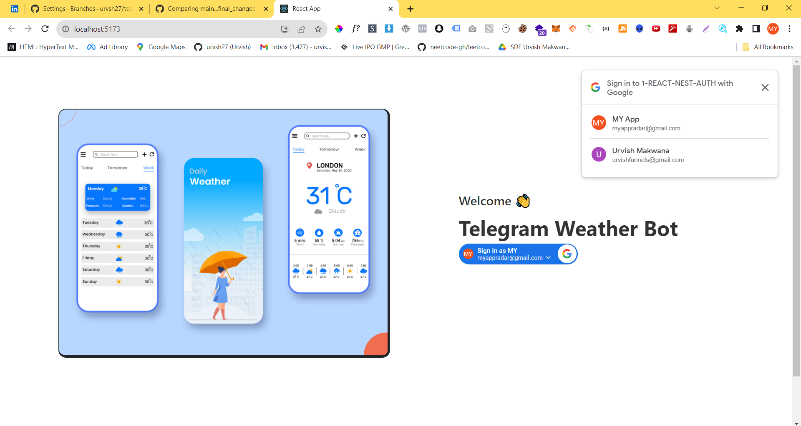
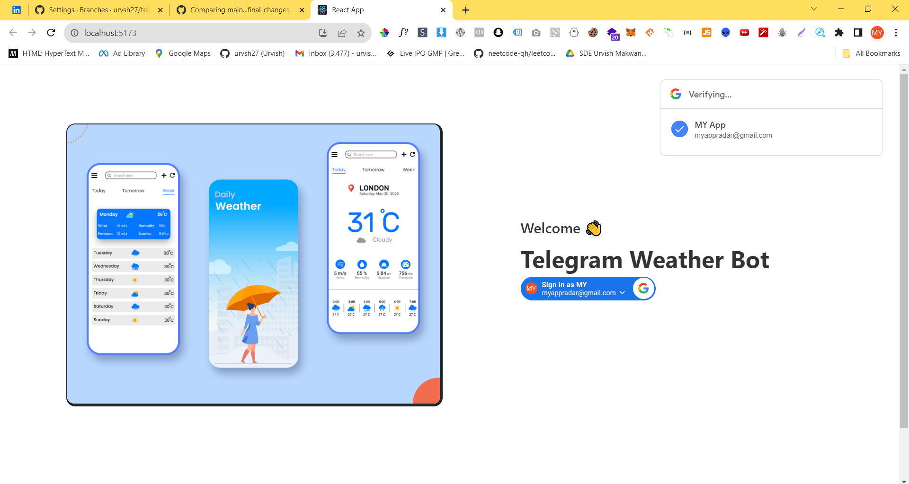
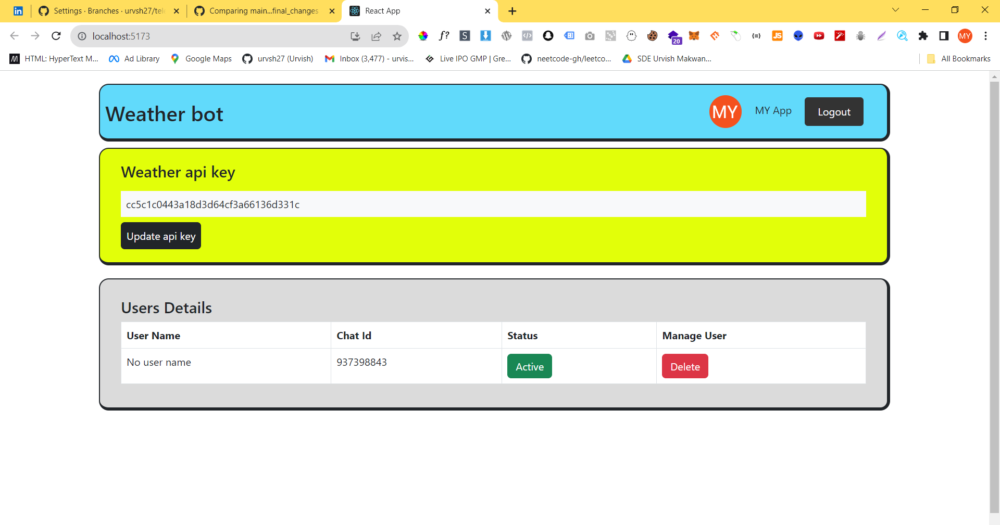
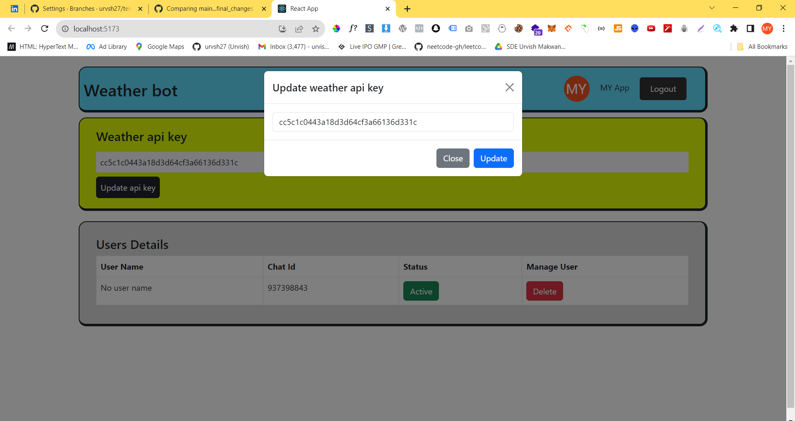
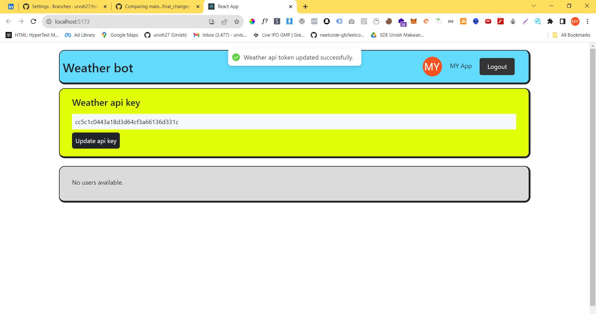

# Telebot : Telegram weather bot (Frontend) 🔥

# Tech stack : Mongo DB, Nodejs, Nestjs, React js
1. Clone this repository
2. Install the node modules by command : `npm install`
3. create .env file and paste text from this file (https://textdoc.co/Qqiur6zsFmBjoVIv)
4. Then run the client : `npm run start`

# Screenshots

# Image Credits 
https://dribbble.com/ARBAB97

# Google login button design
https://developers.google.com/identity/gsi/web/reference/js-reference#shape

